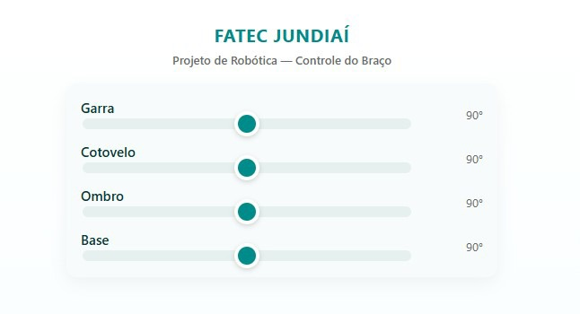
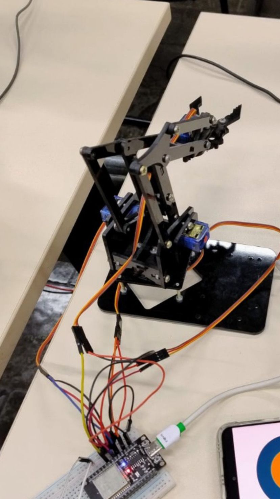

# 🤖 Projeto de Braço Robótico com ESP32

Controle via WebSocket — FATEC Jundiaí

Este projeto consiste no desenvolvimento de um **braço robótico controlado por um ESP32**, utilizando **servos motores** e uma interface de controle criada em **HTML, CSS e JavaScript**.
A comunicação entre o ESP32 e o aplicativo ocorre através de **WebSocket**, permitindo controle em tempo real, gravação e reprodução dos movimentos.

---

## 📸 Demonstração

<p align="center">
  
  <br>
  <strong>📱 Controle via Aplicativo</strong>
</p>

<br>

<p align="center">
  
  <br>
  <strong>🦾 Braço Robótico e ESP32</strong>
</p>


## 🚀 Funcionalidades

* Controle de **Base**, **Ombro**, **Cotovelo** e **Garra**
* Movimentação suave usando servos motores
* Comunicação **WebSocket via Wi-Fi**
* Interface web com sliders
* Controle por aplicativo estilo gamepad
* Recurso de **gravar e reproduzir** movimentos
* Envio de posições em tempo real (feedback)

---

## 🧩 Tecnologias Utilizadas

| Função                            | Linguagem         |
| --------------------------------- | ----------------- |
| Controle do ESP32 e servos        | **C++ (Arduino)** |
| Página web                        | **HTML**          |
| Estilo da página                  | **CSS**           |
| Comunicação WebSocket e interação | **JavaScript**    |

---

## 🔧 Componentes Utilizados

* ✅ Kit de Braço Robótico
* ✅ 4x Servo Motor (SG90/MG90S)
* ✅ Módulo ESP32
* ✅ Protoboard
* ✅ Cabos jumper

---

## 📚 Bibliotecas Utilizadas

* **ESP32**
* **ESP32SERVO**
* **ESP32 board URL:** https://dl.espressif.com/dl/package_esp32_index.json
* **AsyncTCP**
* **ESPAsyncWebServer**


---

## 🔌 Instalação da placa ESP32

Adicione esta URL no Arduino IDE:

```
https://dl.espressif.com/dl/package_esp32_index.json
```

---

## 🗂️ Código e Diagramas

📁 Repositório oficial do código:
*(adicione aqui o link do seu GitHub após publicar)*

---

## 🖥️ Interface Web — Sliders

A interface permite controlar os servos diretamente via navegador:

```
FATEC JUNDIAÍ
Projeto de Robótica — Controle do Braço

Garra:    [---●------]  90°
Cotovelo: [---●------]  90°
Ombro:    [---●------]  90°
Base:     [---●------]  90°
```

---

## ▶️ Como Usar

1. Conecte o ESP32 à fonte de alimentação
2. Suba o código Arduino
3. Acesse o IP mostrado no monitor serial
4. Use o **app** ou a **página web** para controlar o braço
5. Grave e reproduza movimentos quando desejar

---

## 📬 Autor

Projeto desenvolvido para **FATEC Jundiaí — Disciplina de Robótica**.

---
